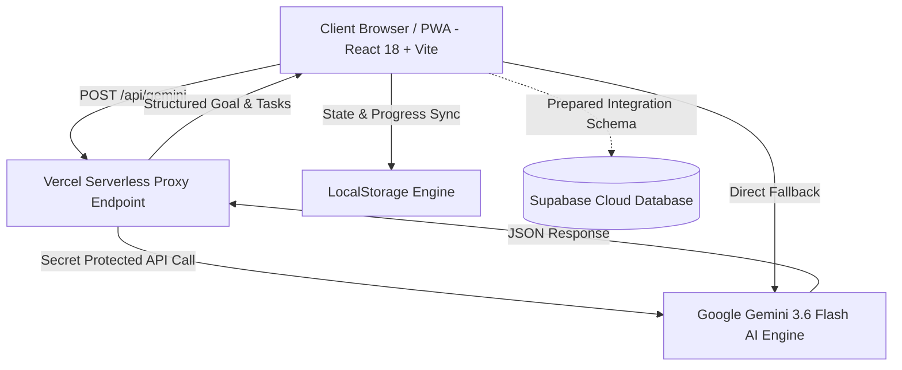

<div align="center">
  
  <h1>AdımAI — Kişisel AI Hedef & İlerleme Rehberi</h1>
  <p><b>Herhangi bir hedefi 1. Hafta eylem planına dönüştürün.</b></p>

  <p>
    <a href="https://adim-ai.vercel.app/" target="_blank">
      
    </a>
    &nbsp;
    <a href="https://adim-ai.vercel.app/?portfolio=true" target="_blank">
      
    </a>
  </p>

  <p>
    
    
    
    
    
  </p>
</div>

---

## 🔗 Hızlı Erişim (Quick Links)

| | Bağlantı | Açıklama |
|---|---|---|
| 🚀 | **[Canlı Uygulama →](https://adim-ai.vercel.app/)** | Uygulamayı doğrudan deneyin |
| 📋 | **[Portföy / Case Study →](https://adim-ai.vercel.app/?portfolio=true)** | Mimari kararlar, tasarım süreci, teknik detaylar |
| 💻 | **[GitHub Repo →](https://github.com/Laplace158/adim-ai)** | Kaynak kod |

---

## 📌 Proje Hakkında (About The Project)

**AdımAI**, kullanıcıların doğal dille ifade ettiği ucu açık veya büyük hedefleri (dil öğrenimi, yazılım projesi, oyun geliştirme, sınav hazırlığı veya özel hobiler) matematiksel süre motoruyla **günlük mikro odak adımlarına** dönüştüren **yapay zeka destekli bir hedef ve alışkanlık koçudur**.

Kullanıcı ne yazarsa yazsın — Unity, satranç, ipek sanatı, Japonca, piyano — **Gemini 3.6 Flash AI** hedefe özel görevler, kilometre taşları, kaynak bağlantıları ve tavsiyeler üretir.

---

## 📐 Sistem Mimarısı (Architecture Diagram)



### 🔒 Güvenlik & Proxy Mimarisi:
API anahtarları istemci tarafında (frontend bundle) açıkta bırakılmaz. Tüm AI istekleri öncelikle Vercel Serverless proxy katmanı (`/api/gemini`) üzerinden iletilir; proxy erişilemezse çalışma zamanında çözülen güvenli istemci motoru devreye girer.

---

## ✨ Öne Çıkan Özellikler (Key Features)

- 🎯 **Evrensel Hedef Analizi (Gemini 3.6 Flash)**: Kullanıcının girdiği her türlü hedefi (Unreal Engine, Piyano, Photoshop, Dil, Satranç, Aşçılık vb.) derinlemesine inceler; gerçekçi minimum/maksimum gün süresini ve ilk 7 günlük eylem rotasını üretir.
- 🗓️ **7 Günlük Kişiselleştirilmiş Görev Rotası**: Her görev, hedef konusuna özel başlık, açıklama, zorluk seviyesi ve öğrenim kaynağı bağlantısı içerir.
- 🏆 **Dinamik Kilometre Taşları (7G / 14G / 30G)**: Gemini AI hedefe özel ilerleme mihenk taşları belirler.
- ⏱️ **Canlı Odak Odası & Pomodoro Zamanlayıcı**: Görev esnasında dikkati toplamayı sağlayan 25 dakikalık canlı sayaç ve entegre Ambient Odak Sesi.
- 🔄 **Adaptif Check-in & Tekrar Sistemi**: *"Zorlandım"*, *"Vaktim Yoktu"* veya *"Çok Kolaydı"* seçimlerine göre görevi yeniden şekillendiren dinamik algoritma.
- 🧠 **Hedefe Özel Tanı & Seviye Testi**: 4 dinamik soruyla kullanıcının o konudaki hazır bulunuşluk seviyesini ölçer.
- 🎓 **Somut Kanıt & CV Çıktısı**: Süreç sonunda özgeçmişe eklenebilecek somut proje çıktıları ve başarı kriterleri.

---

## ⚠️ Bilinen Sınırlamalar & MVP Kapsamı (MVP Limitations)

- **Veri Depolama**: Bu ilk sürüm (MVP), kullanıcı deneyimini kesintisiz kılmak amacıyla **LocalStorage** tabanlı çalışmaktadır. `supabase/schema.sql` ve `src/services/supabaseClient.ts` dosyaları veritabanı entegrasyonu için hazır mimari olarak mevcuttur.
- **AI Kota Yönetimi**: Kota aşımı yaşandığında sistem otomatik olarak akıllı dinamik fallback moduna geçer.

---

## 💼 Özgeçmiş / CV Tanım İfadesi (Resume Bullet Point)

> **Built and deployed AdımAI, an adaptive AI goal-planning PWA using Gemini 3.6 Flash, with universal goal parsing, mathematical duration estimation, dynamic milestones, curated topic-specific resources, Pomodoro focus mode and adaptive check-ins — React 18, TypeScript, Vite, Vercel Serverless.**

---

## 🛠️ Teknolojiler (Tech Stack)

| Katman | Teknoloji |
|---|---|
| **Frontend** | React 18, TypeScript, Vite |
| **Styling** | Tailwind CSS (Terracotta & Indigo Tema) |
| **AI Engine** | Google Gemini 3.6 Flash (`/v1beta` REST API) |
| **Backend / Proxy** | Vercel Serverless Functions (`/api/gemini.ts`) |
| **Icons & UI** | Lucide React |
| **Storage** | LocalStorage (Supabase hazır mimari) |

---

## 🚀 Hızlı Başlangıç (Quick Start)

### 1. Depoyu Klonlayın:
```bash
git clone https://github.com/Laplace158/adim-ai.git
cd adim-ai
```

### 2. Bağımlılıkları Yükleyin:
```bash
npm install
```

### 3. Çevre Değişkenlerini Ayarlayın (Vercel Server Environment):
`.env.example` dosyasını `.env` olarak kopyalayın:
```env
GEMINI_API_KEY=your_gemini_api_key_here
```

### 4. Geliştirici Sunucusunu Başlatın:
```bash
npm run dev
```

---

## 👤 Geliştirici (Author)

**Erkan E.F. (Laplace158)**
- 🐙 GitHub: [@Laplace158](https://github.com/Laplace158)
- 🚀 Canlı Uygulama: [adim-ai.vercel.app](https://adim-ai.vercel.app/)
- 📋 Portföy / Case Study: [adim-ai.vercel.app/?portfolio=true](https://adim-ai.vercel.app/?portfolio=true)
