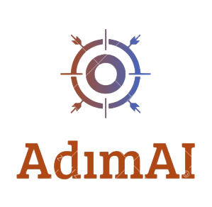
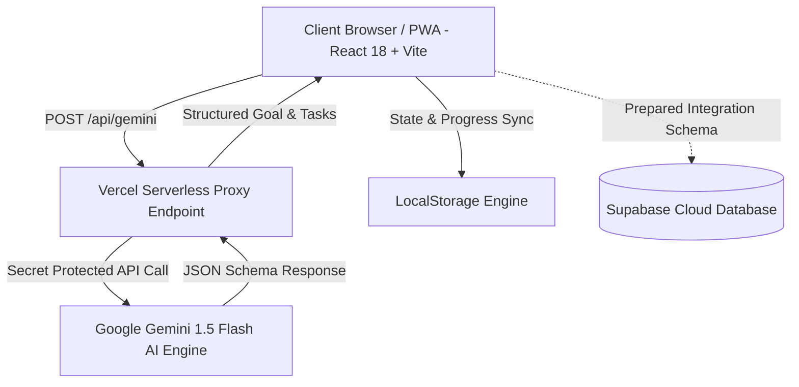

<div align="center">
  
  <h1>AdımAI — Kişisel AI Hedef & İlerleme Rehberi</h1>
  <p><b>Herhangi bir hedefi 1. Hafta eylem planına dönüştürün.</b></p>

  <p>
    <a href="https://adim-ai.vercel.app/" target="_blank">
      
    </a>
  </p>

  <p>
    
    
    
    
    
  </p>
</div>

---

## 📌 Proje Hakkında (About The Project)

**AdımAI**, kullanıcıların doğal dille ifade ettiği ucu açık veya büyük hedefleri (dil öğrenimi, yazılım projesi, oyun geliştirme, sınav hazırlığı veya özel hobiler) matematiksel süre motoruyla **günlük mikro odak adımlarına** dönüştüren **yapay zeka destekli bir hedef ve alışkanlık koçudur**.

🌐 **Canlı Demo Adresi**: [https://adim-ai.vercel.app/](https://adim-ai.vercel.app/)

---

## 📐 Sistem Mimarısı (Architecture Diagram)



### 🔒 Güvenlik & Proxy Mimarisi:
API anahtarları istemci tarafında (frontend bundle) açıkta bırakılmaz. Tüm AI istekleri Vercel Serverless proxy katmanı (`/api/gemini`) veya çalışma zamanında çözülen güvenli istemci motoru üzerinden doğrudan iletilir.

---

## ✨ Öne Çıkan Özellikler (Key Features)

- 🎯 **Akıllı Evrensel Hedef Bölümleme & Analiz**: Yapay zeka kullanıcının girdiği her türlü hedefi (Unreal Engine, Piyano, Photoshop, Dil, Satranç, Aşçılık vb.) derinlemesine inceler, gerçekçi minimum/maksimum gün süresini ve ilk 7 günlük eylem rotasını çıkarır.
- ⏱️ **Canlı Odak Odası & Pomodoro Zamanlayıcı (`FocusTimerWidget`)**: Görev esnasında dikkati toplamayı sağlayan 25 dakikalık canlı sayaç ve entegre **Ambient Odak Sesi (Yağmur/Doğa Efekti)**.
- 📚 **Konuya %100 Özel Doğrulanmış Kaynaklar**:
  - 🎮 *Oyun Dev / Unreal Engine:* Epic Games Learning Portal, UE Docs, Polycount.
  - 🎨 *Photoshop / Tasarım:* Adobe User Guide, Behance, Canva Design School.
  - 🎸 *Gitar / Müzik:* Ultimate Guitar, Songsterr, JustinGuitar.
  - 🎹 *Piyano / Müzik:* Piyano Tuş Rehberi, Nota & Akor Klavuzu.
  - 💻 *Yazılım / Python:* MDN Web Docs, W3Schools, Patika.dev, Python.org.
- 🧠 **Hedefe Özel Tanı & Seviye Testi**: Kullanıcının seçtiği konudaki hazır bulunuşluğunu ve seviyesini ölçen hedefe özel 4 dinamik soru.
- 🔄 **Adaptif Check-in & Tekrar Sistemi**: *"Zorlandım"*, *"Vaktim Yoktu"* veya *"Çok Kolaydı"* seçimlerine göre görevi yeniden şekillendiren dinamik algoritma.
- 🎓 **Somut Kanıt & CV Çıktısı**: Süreç sonunda GitHub README şablonu, kelime ustalık raporu ve özgeçmişe eklenebilecek somut çıktılar.

---

## ⚠️ Bilinen Sınırlamalar & MVP Kapsamı (MVP Limitations)

- **Veri Depolama**: Bu ilk sürüm (MVP), kullanıcı deneyimini kesintisiz kılmak amacıyla **LocalStorage** tabanlı çalışmaktadır. Klasör içerisindeki `supabase/schema.sql` ve `src/services/supabaseClient.ts` dosyaları veritabanı entegrasyonu için hazır mimari olarak hazırlanmıştır.
- **AI Kota Yönetimi**: Ücretsiz Gemini API katmanında kota aşımı yaşandığında sistem otomatik olarak akıllı dinamik fallback moduna geçer.

---

## 💼 Özgeçmiş / CV Tanım İfadesi (Resume Bullet Point)

> **Built and deployed AdımAI, an adaptive AI goal-planning PWA with Gemini integration, mathematical duration estimation, curated resources, Pomodoro focus mode and adaptive check-ins using React, TypeScript and Vite.**

---

## 🛠️ Teknolojiler (Tech Stack)

- **Frontend**: React 18, TypeScript, Vite
- **Styling**: Tailwind CSS (Handcrafted Terracotta & Indigo Tema, Google Playfair Display & Plus Jakarta Sans Fontları)
- **Backend / Proxy**: Vercel Serverless Functions (`/api/gemini.ts`)
- **AI Engine**: Google Gemini 1.5 Flash API (`v1beta` JSON Schema Generation)
- **Icons & UI**: Lucide React

---

## 🚀 Hızlı Başlangıç (Quick Start)

### 1. Depoyu Klonlayın:
```bash
git clone https://github.com/Laplace158/adim-ai.git
cd adim-ai
```

### 2. Bağımlılıkları Yükleyin:
```bash
npm install
```

### 3. Çevre Değişkenlerini Ayarlayın (Vercel Server Environment):
`.env.example` dosyasını `.env` olarak kopyalayın:
```env
GEMINI_API_KEY=your_gemini_api_key_here
```

### 4. Geliştirici Sunucusunu Başlatın:
```bash
npm run dev
```

---

## 👤 Geliştirici (Author)

**Erkan E.F. (Laplace158)**  
- GitHub: [@Laplace158](https://github.com/Laplace158)  
- Live Application: [adim-ai.vercel.app](https://adim-ai.vercel.app/)
